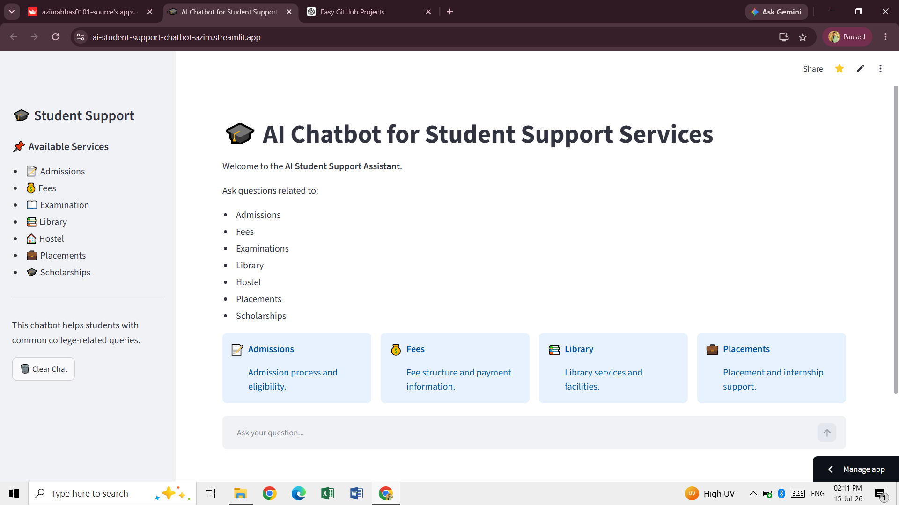
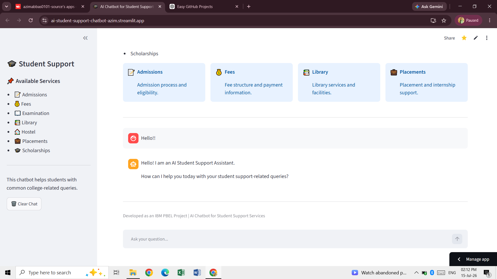
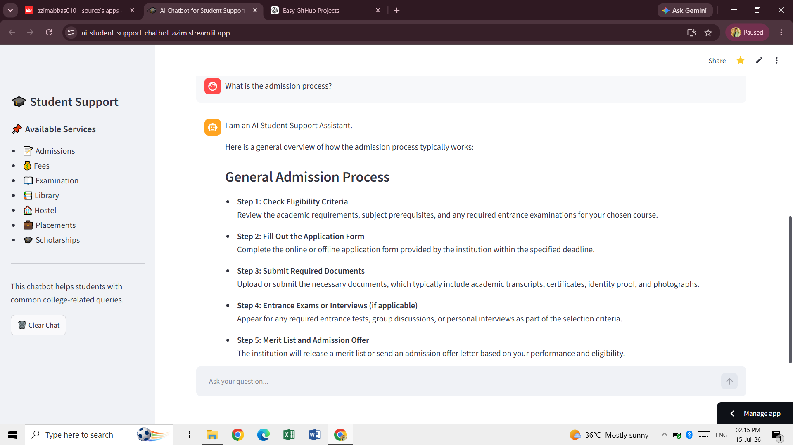
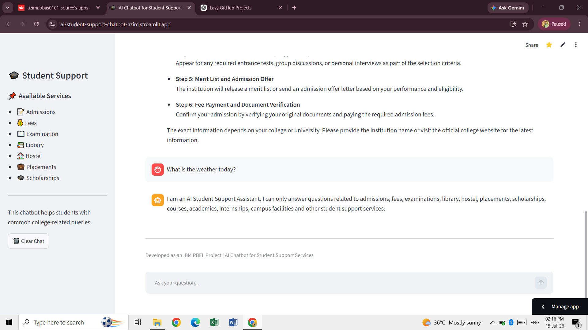

# 🎓 AI Chatbot for Student Support Services

## 📖 Project Overview

The **AI Chatbot for Student Support Services** is an AI-powered web application developed using **Python**, **Streamlit**, and the **Google Gemini API**.

The chatbot is designed to assist students by answering college-related questions such as admissions, fees, examinations, library services, hostel facilities, placements, scholarships, and other student support queries.

To keep the chatbot focused, it politely declines unrelated questions and encourages users to ask only student support related queries.

---
## 🌐 Live Demo

Try the AI Chatbot here: https://ai-student-support-chatbot-azim.streamlit.app/

---

# 🎯 Objectives

- Provide instant support to students.
- Reduce repetitive administrative queries.
- Improve access to college-related information.
- Demonstrate the practical use of Artificial Intelligence in education.
- Build an easy-to-use chatbot interface.

---

# ✨ Features

- 🤖 AI-powered chatbot using Google Gemini
- 📝 Admission guidance
- 💰 Fee information
- 📖 Examination support
- 📚 Library information
- 🏠 Hostel assistance
- 💼 Placement guidance
- 🎓 Scholarship information
- 💬 Chat history
- 🗑️ Clear Chat option
- 📋 Professional sidebar with available services
- 🚫 Politely rejects unrelated questions
- ⚡ Fast and responsive interface

---

# 🛠️ Technologies Used

- Python
- Streamlit
- Google Gemini API
- GitHub

---
## 🔗 Repository

GitHub Repository:

https://github.com/azimabbas0101-source/AI-Chatbot-for-Student-Support-Services

---
# 📁 Project Structure

```
AI-Chatbot-for-Student-Support-Services/
│
├── app.py
├── chatbot.py
├── requirements.txt
├── README.md
└── test.py
```

---

# 🚀 Installation

### Clone the repository

```bash
git clone https://github.com/azimabbas0101-source/AI-Chatbot-for-Student-Support-Services.git
```

### Go to the project folder

```bash
cd AI-Chatbot-for-Student-Support-Services
```

### Install dependencies

```bash
pip install -r requirements.txt
```

### Add your Gemini API Key

Create a `.env` file and add:

```text
GEMINI_API_KEY=YOUR_API_KEY
```

Or configure the environment variable in Streamlit Cloud.

### Run the project

```bash
streamlit run app.py
```

---

# 💡 Sample Questions

You can ask questions like:

- What is the admission process?
- What documents are required for admission?
- What is the fee structure?
- How can I pay my fees?
- When are semester examinations conducted?
- What are the library timings?
- Is hostel accommodation available?
- Which companies visit the campus?
- How can I apply for a scholarship?

---

# 📸 Project Screenshots

## 1. Home Page



---

## 2. Chatbot Greeting



---

## 3. Student Support Query



---

## 4. Out-of-Scope Query



---

# 🔮 Future Improvements

- Voice-based interaction
- Multi-language support
- Student login system
- Database integration
- College-specific knowledge base
- Admin dashboard
- PDF document support

---

# 👨‍💻 Developer

**Azim Abbas**

MBA (Finance & Marketing)

Shri Ramswaroop Memorial College of Engineering and Management (SRMCEM)

IBM PBEL Internship Project

LinkedIn:

GitHub: 

---

# 📌 Project Status

✅ Completed and Successfully Deployed 
